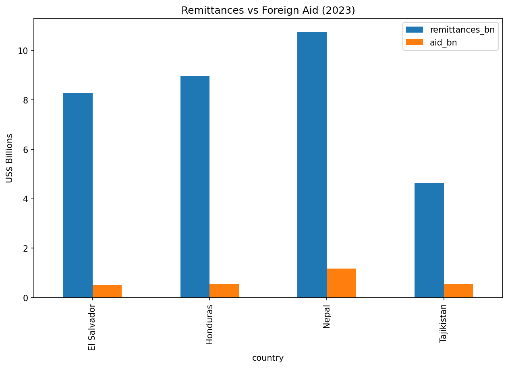
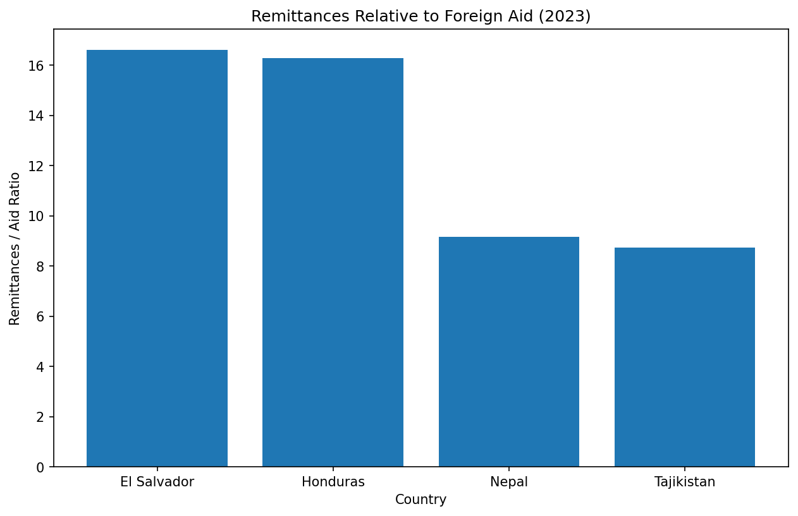
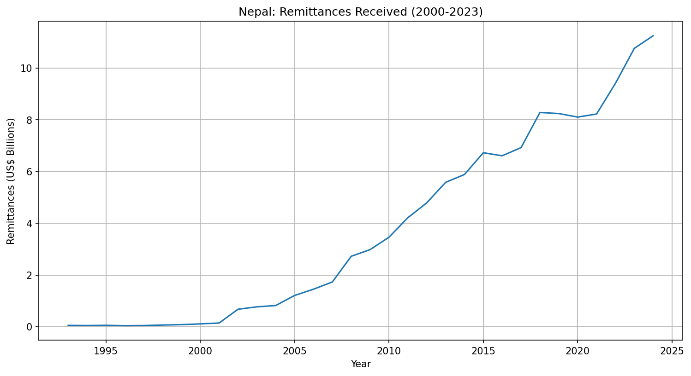
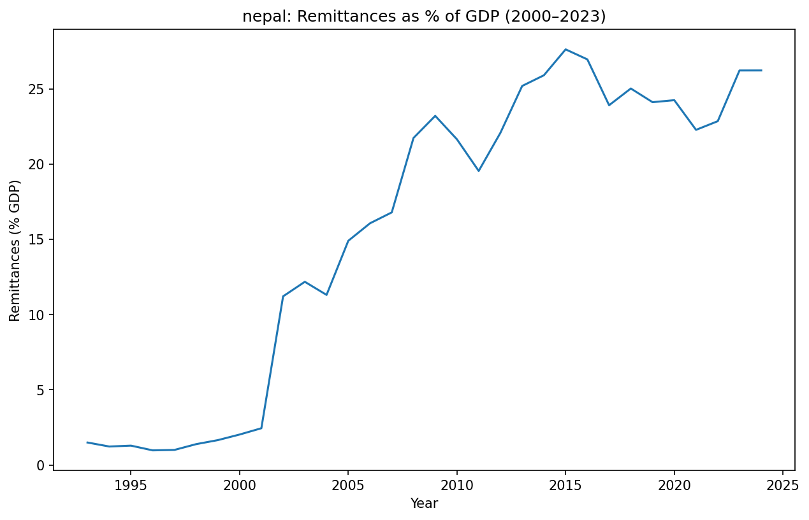
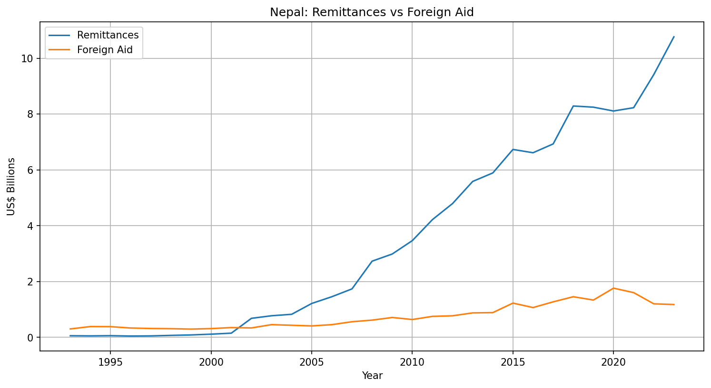
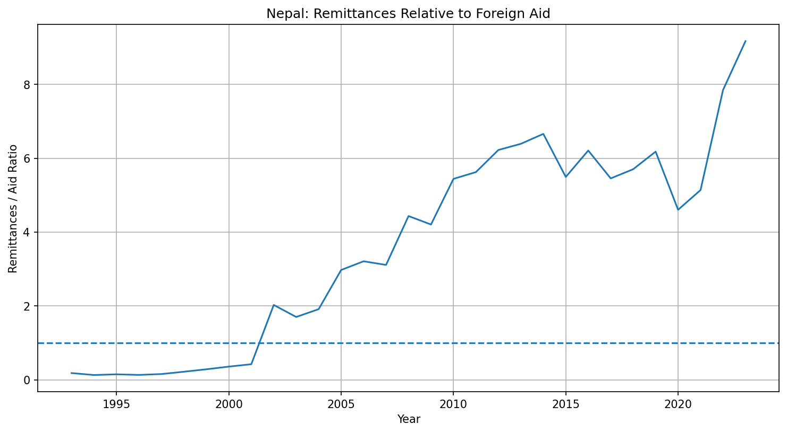

# Migration, Remittances and Development Finance

> **Research Question:** To what extent do remittances act as an alternative source of development finance in remittance-dependent developing economies?

---

## Overview

Remittances are financial transfers sent by migrants to their home countries. In many developing economies, remittances represent a substantial share of national income and can often exceed official development assistance (foreign aid).

This project investigates which countries are most dependent on remittances and explores whether migration acts as an informal mechanism of international development by transferring resources directly to households in migrants' countries of origin.

---

## Data Sources

All data is retrieved from the **World Bank API** using the following indicators:

| Indicator Code | Description |
|---|---|
| `BX.TRF.PWKR.DT.GD.ZS` | Personal remittances received (% of GDP) |
| `BX.TRF.PWKR.CD.DT` | Personal remittances received (current US$) |
| `DT.ODA.ODAT.CD` | Net official development assistance received (current US$) |

---

## Results

### Remittances vs Foreign Aid Across Countries (2023)

In 2023, remittances substantially exceeded foreign aid across all four case study countries: El Salvador, Honduras, Nepal and Tajikistan. Nepal received the largest absolute volume of remittances at over US$10 billion, compared to just over US$1 billion in foreign aid.


*Bar chart comparing total remittances received (blue) against foreign aid received (orange) in US$ billions for El Salvador, Honduras, Nepal and Tajikistan in 2023.*

In 2023, remittances exceeded foreign aid by a factor of over 16 in both El Salvador and Honduras, making them the most remittance-dependent relative to aid among the four countries. Nepal and Tajikistan showed lower but still substantial ratios of approximately 9.


*Bar chart showing the ratio of remittances to foreign aid for each country in 2023. A value of 16 means remittances were 16 times larger than foreign aid received.*

---

### Case Study: Nepal

Nepal provides a particularly clear example of the growing importance of remittances as a source of development finance. The charts below trace the long-run trajectory of remittance inflows from the early 1990s through to 2023.


*Line chart showing the total value of remittances received by Nepal in US$ billions over time. Remittances grew rapidly from near zero in the early 1990s to over US$11 billion by 2023.*

Remittances have also grown as a share of Nepal's economy, rising from under 5% of GDP in the early 2000s to consistently above 20% in recent years, making Nepal one of the most remittance-dependent economies in the world.


*Line chart showing remittances received by Nepal as a percentage of GDP. The sharp rise after 2001 reflects a rapid increase in labour migration.*

Compared directly with foreign aid, remittances have far outpaced official assistance. While foreign aid has remained relatively flat, remittances have grown more than tenfold over the same period.


*Line chart comparing the absolute value of remittances (blue) and foreign aid (orange) received by Nepal from the early 1990s to 2023.*

Nepal's remittances first exceeded foreign aid around 2001, crossing the ratio of 1 for the first time. By 2023 remittances were approximately 9 times larger than aid, the highest ratio recorded in the data.


*Line chart showing the ratio of remittances to foreign aid in Nepal over time. The dashed line at 1.0 marks the point where remittances equal aid. Values above this line indicate remittances exceed aid.*

---

## Discussion

The findings suggest that migration may act as an informal mechanism of international development. Unlike foreign aid, remittances are private transfers that flow directly to households and can be used according to local needs and priorities.

However, remittance dependence also carries risks:
- **Economic vulnerability** - remittance inflows may fall if migrants lose employment in destination countries.
- **Brain drain** - emigration of skilled workers can reduce domestic human capital in sectors such as healthcare, education and engineering.

The findings therefore highlight only one aspect of migration's economic impact. A full assessment would need to weigh these costs against the financial benefits of remittances.

---

## Conclusion

The evidence indicates that remittances are a significant source of external finance and, in many remittance-dependent economies, exceed official foreign aid inflows. While remittances should not be viewed as a complete substitute for development assistance, they appear to play an increasingly important role in supporting economic development and household welfare in developing countries.

---

## Further Research

Future research could examine the wider economic effects of emigration by analysing indicators related to human capital and productivity, for example: whether countries with high skilled emigration experience slower GDP per capita growth, lower productivity, or reduced investment in healthcare and education.

---

## Technologies Used

- **Python 3**
- **pandas** - data manipulation and analysis
- **requests** - accessing the World Bank API
- **matplotlib** - data visualisation

## Installation

```bash
git clone https://github.com/yourusername/your-repo-name.git
pip install -r requirements.txt
```

## Usage

Open the notebook in Jupyter:

```bash
jupyter notebook your_notebook_name.ipynb
```
